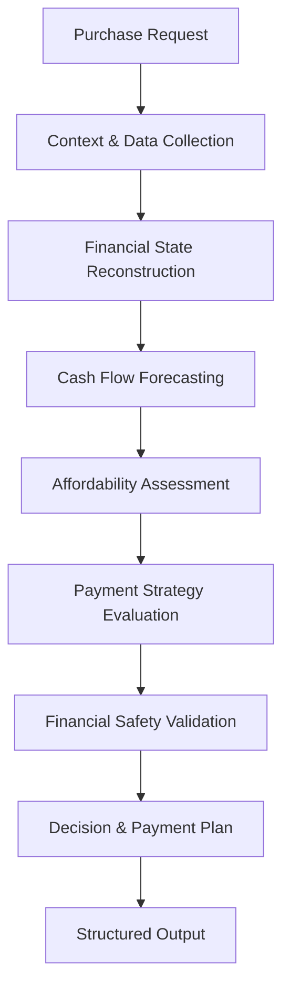

# AffordSense 🧠💰
### Think Smart. Spend Wise.
**An AI-Powered Financial Decision-Making Agent**

AffordSense is an intelligent financial decision-making agent that helps users determine whether they can safely afford a purchase and identifies the most suitable way to pay for it.

Instead of relying solely on the current account balance, AffordSense analyzes income, recurring expenses, pending transactions, financial commitments, personal preferences, and future cash flow to deliver personalized affordability assessments and payment recommendations.

**Example:** *"Can I afford this laptop without compromising my financial stability?"*

AffordSense evaluates the user's financial situation, forecasts future balances, and determines whether to pay in full, split the payment, use installments, wait, or avoid the purchase.

---

## ✨ Key Features

- **💰 Financial Context Analysis** — Reconstructs a user's financial position using account balances, income, recurring expenses, pending transactions, and financial history.
- **🧠 Context-Aware Decision Making** — Incorporates individual priorities, payment preferences, financial commitments, and relevant information from messages and documents.
- **📊 Intelligent Affordability Assessment** — Calculates the maximum amount that can safely be spent while protecting essential expenses and the user's preferred minimum balance.
- **📅 Future Cash Flow Forecasting** — Projects financial balances over time to identify when a purchase becomes financially feasible.
- **💳 Smart Payment Planning** — Evaluates full payments, partial payments, installment options, and deferred purchases.
- **🔍 Financial Document Interpretation** — Uses supporting evidence such as payroll letters, bank statements, bills, and receipts to recover relevant financial information.
- **🛡️ Financial Safety Validation** — Checks payment schedules and proposed spending adjustments against financial constraints.
- **🌍 Multi-Currency Support** — Handles multiple home currencies using the provided exchange-rate data.
- **📝 Explainable Recommendations** — Produces concise explanations supported by relevant financial facts behind each recommendation.

---

## ⚙️ How It Works

AffordSense follows a structured financial evaluation and decision-making workflow.



### Decision Workflow

1. **Request Processing** — Reads purchase requests and identifies the associated user, requested amount, deadline, and available payment options.
2. **Context Collection** — Retrieves relevant financial profiles, transaction records, messages, images, and supporting evidence.
3. **Financial State Reconstruction** — Determines available funds, upcoming commitments, confirmed income, and essential expenses while accounting for duplicate transaction records.
4. **Cash Flow Forecasting** — Simulates future balances while protecting the user's minimum balance and essential financial obligations.
5. **Affordability Evaluation** — Calculates how much can safely be paid immediately and classifies the purchase based on its financial feasibility.
6. **Payment Strategy Selection** — Evaluates full payment, partial payment, supported installment plans, waiting, and permitted flexible spending adjustments.
7. **Safety Validation** — Verifies that the proposed plan remains feasible throughout its payment schedule.
8. **Decision Generation** — Produces a structured recommendation with a payment plan, projected dates, and a financial explanation.

---

## 📋 Decision Outputs

For every purchase request, AffordSense generates a structured recommendation.

| Output | Description |
|---|---|
| `request_id` | Unique identifier of the purchase request |
| `amount_safe_to_pay` | Maximum safe amount payable on the request date |
| `affordability_status` | Classification of the purchase's financial feasibility |
| `recommended_payment_method` | Recommended payment strategy |
| `payment_plan` | Chronological schedule of payment dates and amounts |
| `earliest_date_for_full_payment` | Earliest forecast date when the full amount can be paid safely |
| `spending_changes_needed` | Permitted adjustments to flexible recurring expenses |
| `decision_explanation` | Short explanation supported by financial facts |

### Affordability Statuses

| Status | Meaning |
|---|---|
| `affordable_now` | The full purchase can be completed immediately within the financial safety constraints |
| `affordable_with_plan` | The purchase can be completed through a feasible payment schedule or permitted spending adjustments |
| `affordable_later` | The purchase is not currently feasible but is forecast to become affordable |
| `not_affordable` | The purchase cannot be completed safely within the forecast period |

### Payment Methods

- `full_payment` — Pay the complete amount immediately.
- `partial_payment` — Split the purchase into two feasible payments.
- `installments` — Use a supported installment plan.
- `wait` — Delay the purchase until sufficient funds become available.
- `not_recommended` — Avoid proceeding with the purchase under the evaluated conditions.

---

## 🗂️ Project Structure

```text
AffordSense/
├── AGENTS.md
├── README.md
├── problem_statement.md
├── code/
│   └── main.py
├── dataset/
│   ├── requests.csv
│   ├── output.csv
│   ├── sample_requests.csv
│   ├── financial_profiles.csv
│   ├── financial_events.csv
│   ├── request_payment_options.csv
│   ├── exchange_rates.csv
│   ├── messages.csv
│   ├── images.csv
│   └── media/
│       └── images/
├── evaluation/
│   └── usage_report.md
├── output.csv
└── code.zip
```

### Dataset Overview

| File | Purpose |
|---|---|
| `requests.csv` | Purchase requests requiring predictions |
| `sample_requests.csv` | Solved examples for understanding the expected output |
| `financial_profiles.csv` | User balances, priorities, preferences, and minimum balance requirements |
| `financial_events.csv` | Historical and upcoming financial transactions |
| `request_payment_options.csv` | Available payment options for individual requests |
| `exchange_rates.csv` | Fixed, dated currency conversion rates |
| `messages.csv` | Additional context associated with users, requests, and events |
| `images.csv` | References to supporting financial documents and extracted evidence |
| `media/images/` | Supporting image files |

---

## 🚀 Getting Started

### Prerequisites

- Python 3
- Git
- Required dependencies for the implementation

### Installation

Clone the repository:

```bash
git clone https://github.com/Sreeganesh-Shelmohker/Afford-Sense
cd affordsense
```

Install the required dependencies, if applicable:

```bash
pip install -r requirements.txt
```

### Run the Project

Execute the main entry point:

```bash
python code/main.py
```

The solution reads the input data from the `dataset/` directory and generates predictions in the root-level `output.csv` file.

### Output Validation

After execution, verify that:

- `output.csv` exists in the repository root.
- Every purchase request has exactly one prediction.
- The output contains the required columns in the specified order.
- Safe-to-pay amounts remain within the requested amount.
- Payment plans satisfy the applicable financial constraints.

---

## 🛡️ Financial Safety Principles

AffordSense is designed around financial feasibility rather than account balance alone.

- **Protect essential expenses** — Essential financial obligations take priority over discretionary purchases.
- **Maintain minimum balances** — Forecast balances must remain above the user's preferred minimum balance throughout the payment plan.
- **Respect confirmed income timing** — Income is counted only when it is expected to settle.
- **Account for pending transactions** — Upcoming financial commitments are included in affordability calculations.
- **Limit spending adjustments** — Only recurring expenses explicitly marked as flexible may be modified.
- **Validate installment plans** — Recommended installment schedules must match the available payment options.
- **Ensure payment feasibility** — Every proposed payment must be supported by the projected cash flow.

---

## 📈 Evaluation

AffordSense is evaluated against reference predictions for the provided purchase requests.

The evaluation considers:

- Accuracy of safe-to-pay amount calculations
- Correctness of affordability classifications
- Payment method and payment plan validity
- Accuracy of projected full-payment dates
- Validity of permitted spending adjustments
- Consistency and usefulness of decision explanations

The final solution must produce valid predictions for all requests while satisfying the challenge's financial safety and output-format requirements.

---

## 🧩 Design Principles

| Principle | Description |
|---|---|
| **Personalization** | Adapt financial recommendations to individual circumstances and preferences |
| **Predictive Reasoning** | Consider future cash flow instead of relying only on current balances |
| **Financial Responsibility** | Prioritize essential expenses and minimum balance requirements |
| **Explainability** | Provide understandable recommendations backed by financial evidence |
| **Reliability** | Validate financial constraints and maintain consistent output |
| **Adaptability** | Support different currencies, payment options, and financial scenarios |

---

## 🏆 Challenge

Developed as part of the **HackerRank Orchestrate — September 2026** 24-hour hackathon challenge.

The project explores how AI-assisted financial reasoning, contextual data processing, and cash flow forecasting can help people make informed purchasing decisions.

---

<div align="center">

### AffordSense
**Think Smart. Spend Wise.**

*Making financial decisions more intelligent, informed, and sustainable.*

</div>
